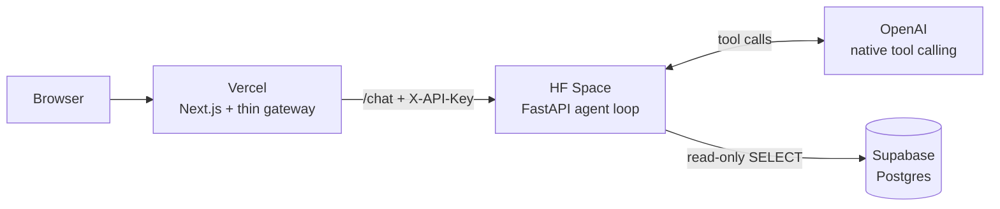

# Manufacturing Text-to-SQL Agent

**Live demo → [text-to-sql-ai-agent-pi.vercel.app](https://text-to-sql-ai-agent-pi.vercel.app)**

An **agentic text-to-SQL assistant** over a manufacturing database. Ask a plain-language question
(Turkish or English) and an LLM inspects the schema, writes SQL, runs it **read-only** against the
database, fixes its own query on error, and answers in plain language — and can reveal the exact SQL it
ran as proof.

## What it does

You ask something like *"Which production line had the most unplanned downtime last month?"*. Instead of
one-shot SQL, the model works **agentically** with two tools:

- `get_schema()` — inspect the live tables and columns
- `run_query(sql)` — execute a read-only `SELECT`

It runs a loop: call a tool → read the result *or the database error* → correct itself → answer. Seeing
the real error (e.g. `column "duration" does not exist`) is exactly what lets it fix a bad query and
retry. Each answer ships with the SQL that produced it (hidden by default, expandable) and the result
rows, so you can verify the answer came from real data.

## The data — a manufacturing factory

The database models a **discrete-manufacturing** factory making industrial electrical / electromechanical
products (switchgear panels, contactors, motors, transformers, control units). It holds ~12 months of
synthetic-but-consistent data across eight tables:

- **Catalog** (the stage & cast): `products`, `production_lines`, `machines`, `shifts`.
- **Events** (what actually happened, over time): `work_orders` (a batch — what/where/when),
  `production_output` (produced vs scrap), `downtime_events` (planned/unplanned stops),
  `quality_inspections` and the `defects` found in them.

Full mental model + ER diagram: **[backend/db/README.md](backend/db/README.md)**.

Sample questions it can answer:

- "Which production line had the most unplanned downtime last month, and which reason codes drove it?"
- "What's the scrap rate by product over the last quarter, and which three are worst?"
- "During the Night shift, which machines caused the most downtime minutes?"
- "Which products have the highest defect rate, and what are their most common defect types?"

## Architecture



Two services only: the Postgres database plays the role of "the company's existing system", and the
FastAPI service adds the natural-language layer on top of it — no separate business backend. The Next.js
`/api/chat` route is a thin gateway (adds the shared API key, proxies to the backend); all logic lives in
the FastAPI service.

## Stack

| Layer | Tech |
|---|---|
| Frontend | Next.js 16 (App Router, TypeScript, Tailwind, shadcn/ui) + thin gateway API route |
| Backend | Python / FastAPI (layered, async), OpenAI native tool calling — hand-written agent loop, no framework |
| Database | PostgreSQL — Docker locally, Supabase in production |
| Tooling | Poetry, asyncpg, Alembic (raw-SQL migrations, no ORM) |
| Deploy | Vercel (frontend) · Hugging Face Spaces (backend, Docker) · Supabase (Postgres) |

## Guardrails

The model writes the SQL, so a query could be wrong or unsafe. Independent layers (defense in depth) keep
the database protected:

- **Read-only access** — the app connects as a database user that can *only read*. Even if the model
  emitted `DROP TABLE`, the database itself would reject it. This is the main safeguard.
- **Query validation** — every generated query must be a single read-only `SELECT`; risky commands are
  blocked and a row limit is always applied.
- **Query timeout** — the database cancels any query that runs too long, so one heavy query can't tie up
  the service.

## Run locally

Postgres runs in Docker; the apps run on the host for fast hot-reload.

```bash
# 1. Database (from repo root)
docker compose up -d

# 2. Backend — FastAPI on http://localhost:8000 (from backend/)
poetry install
poetry run alembic upgrade head   # create tables + read-only role
poetry run poe seed               # generate ~12 months of data
poetry run uvicorn app.main:app --reload

# 3. Frontend — Next.js on http://localhost:3000 (from frontend/)
npm install
npm run dev
```

Copy `backend/.env.example` → `backend/.env` and `frontend/.env.local.example` → `frontend/.env.local`
and fill in the values (database URLs, OpenAI key, shared API key).
