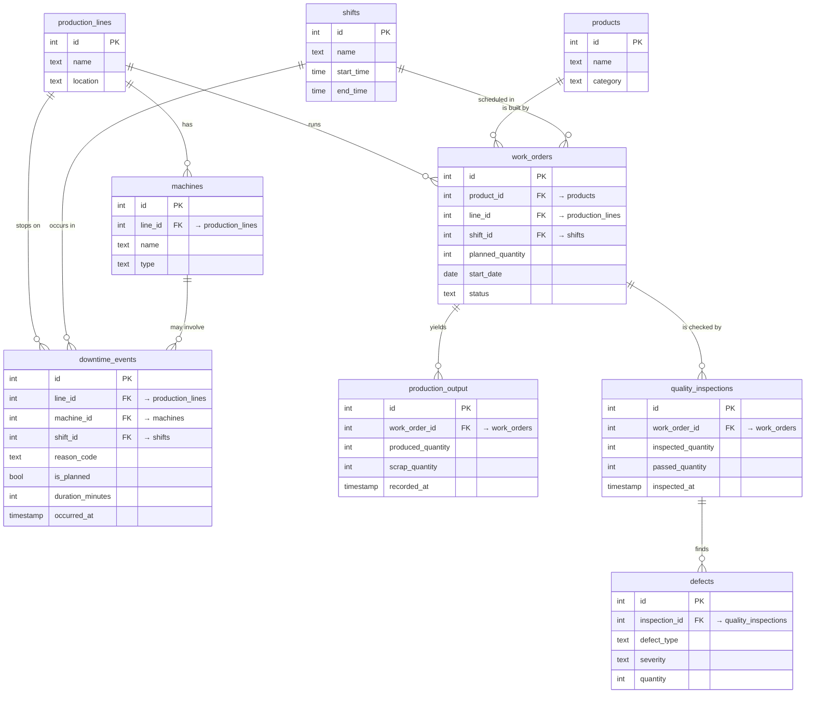

# The Database — Mental Model

This is the mental model behind the schema — what the factory is and how its tables relate, in plain
language before any SQL. The goal is to *picture* the factory first; the tables are a faithful
translation of this picture.

---

## 1. What does this factory make?

Imagine a **discrete-manufacturing** factory that builds **industrial electrical / electromechanical
products** — things like switchgear panels, contactors, motors, transformers, and control units.

"Discrete" means it makes **countable, separate units** (you can point at "panel #57"), as opposed to
*process* manufacturing which makes continuous stuff measured by volume (paint, chemicals, fuel). This
distinction matters because our whole schema is built around *counting things*: how many were planned,
how many came out, how many were scrap, how many passed inspection. Discrete = countable = lots of
integer quantities to aggregate.

---

## 2. The shop floor — a guided tour

Walk onto the floor and look around. Here is what you see, and the word we use for each thing:

- **Products** — the catalog of items the factory is *capable* of making. "Type C Contactor",
  "400A Switchgear Panel". This is a menu, not a schedule. Nothing is being built just because a product
  exists in the catalog.

- **Production lines** — the physical lanes/cells on the floor where work happens. "Assembly Line A",
  "Winding Cell 2". A line is a *place*. Products flow down a line to get built.

- **Machines** — the equipment that sits **on** a line. A press, a winder, a tester. Each machine
  belongs to exactly one line. This is our first real *relationship*: a line **has many** machines; a
  machine **belongs to** one line.

- **Shifts** — the factory runs in time blocks: Morning, Evening, Night. A shift is a *when*, a recurring
  daily window (e.g. Morning = 06:00–14:00). The same three shifts repeat every day.

So far we have the **stage and the cast**: *what* we can make (products), *where* we make it (lines +
machines), and *when* people are working (shifts). Nothing has happened yet — these are catalog/reference
tables. They rarely change.

---

## 3. The thing that actually happens: a work order

A **work order** is the heart of the factory. It is a single instruction that says:

> "Build **300 units** of **Type C Contactor**, on **Assembly Line A**, during the **Morning** shift,
> starting **March 3rd**."

Notice it points at three of our catalog tables at once: a **product** (what), a **line** (where), and a
**shift** (when). That is three foreign keys living on one row. A work order is where the abstract
catalog turns into a concrete plan.

A work order has a **planned_quantity** (the order: "make 300") and a **status** (planned / in progress /
completed). But the order is a *plan* — what actually came off the line is a separate fact:

- **Production output** records **reality** for a work order: `produced_quantity` (how many we actually
  built) and `scrap_quantity` (how many were ruined and thrown away). One work order can have output
  recorded (e.g. per day or per batch), so output **belongs to** a work order.

The gap between `planned_quantity` (on the work order) and `produced_quantity` (on its output) is exactly
the kind of thing a manager asks about: *"Did Line A hit its targets last month?"* — and answering it
means looking at **two tables together**. That "looking at two tables together" is a **JOIN** — the
central operation behind almost every question this assistant answers.

---

## 4. When things go wrong: downtime and quality

Two things interrupt the happy path of "plan → produce". Both are their own tables because both are things
managers obsess over.

### Downtime — the line stopped

A **downtime event** is a recorded stop. The press jammed; we ran out of raw material; we did scheduled
maintenance. Each event records:

- which **line** (and optionally which specific **machine**) stopped,
- which **shift** it happened in,
- a **reason_code** from a small fixed set — `setup/changeover`, `breakdown`, `material shortage`,
  `planned maintenance`,
- **is_planned** (a true/false flag) — was this stop expected or not? Planned maintenance is *planned*;
  a breakdown is *unplanned*. This flag is the difference between "we chose to stop" and "we were forced
  to stop", and it's the basis of the headline question in the spec: *"Which line had the most
  **unplanned** downtime last month?"*
- **duration_minutes** — how long the stop lasted,
- **occurred_at** — the exact timestamp.

Downtime hangs off **lines, machines, and shifts** — but notice it does **not** point at a work order.
A stop is about the *equipment and the floor*, not about one specific batch.

### Quality — was it built correctly?

After production, parts get inspected. This is a little **chain** of two tables:

- A **quality inspection** is a QC check tied to a **work order**: out of `inspected_quantity` units
  checked, how many `passed_quantity` passed?
- A **defect** is a specific problem found *during* an inspection: a `defect_type` (e.g. "loose terminal"),
  a `severity`, and a `quantity`. A defect **belongs to** an inspection.

So quality forms a chain that reaches all the way back to production:

```
work_order → quality_inspection → defect
```

That chain is why the spec says quality "hangs off" production: to ask *"what's the defect rate for Type C
Contactors?"* you have to walk `defects → inspections → work_orders → products` — a multi-table JOIN. This
is deliberate: it forces interesting queries instead of shallow single-table counts.

---

## 5. The whole map in one picture

Below is an **ER (entity-relationship) diagram**. If you open this file in VS Code's Markdown Preview
(or on GitHub), it renders as a real diagram; in raw text you still read it top-to-bottom.

How to read it:
- Each box is a **table**; the lines inside are its **columns** with a type and a key marker.
- `PK` = **primary key** (the row's unique id). `FK` = **foreign key** (points at another table's PK).
- The connector between two tables shows the relationship. The `||` end means **exactly one**; the
  `o{` (crow's foot) end means **many**. So `production_lines ||--o{ machines` reads:
  **one** production line has **many** machines — and each machine belongs to exactly one line.
- Column types below (`int`, `text`, `bool`, `timestamp`, `time`) are *illustrative* — the exact
  Postgres types are pinned in the migrations. Read this for shape, not types.



Same thing as a plain list of "who points at whom" (handy if the diagram doesn't render):

| This table | points at (foreign key →) | meaning |
|---|---|---|
| `machines` | `production_lines` | a machine sits on one line |
| `work_orders` | `products`, `production_lines`, `shifts` | a batch: what, where, when |
| `production_output` | `work_orders` | actual produced/scrap for a work order |
| `downtime_events` | `production_lines`, `machines`, `shifts` | a stop on the floor |
| `quality_inspections` | `work_orders` | a QC check of a batch |
| `defects` | `quality_inspections` | a problem found in a check |

---

## 6. Two table "shapes" — why this matters later

Group the eight tables into two kinds:

- **Reference / catalog tables** (the stage & cast): `products`, `production_lines`, `machines`,
  `shifts`. Small, mostly static, you set them up once. They are the things other rows *point at*.
- **Event / fact tables** (what actually happened, over time): `work_orders`, `production_output`,
  `downtime_events`, `quality_inspections`, `defects`. These grow constantly and carry the timestamps
  (`start_date`, `recorded_at`, `occurred_at`, `inspected_at`). Almost every interesting question
  filters or groups one of these by time and joins it back to a catalog table for a human-readable name.

Keep this split in mind: **"give me the names from a catalog table, sliced/aggregated from an event
table, filtered by time"** is the shape of nearly every question this assistant will answer.
